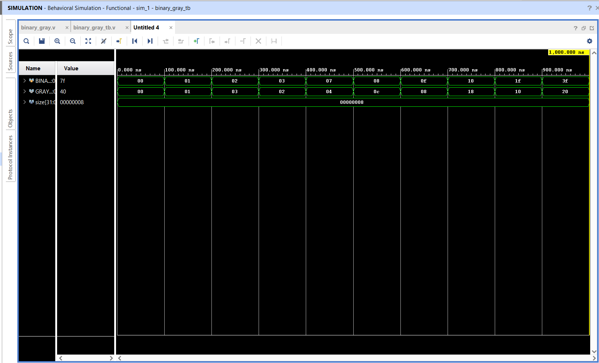
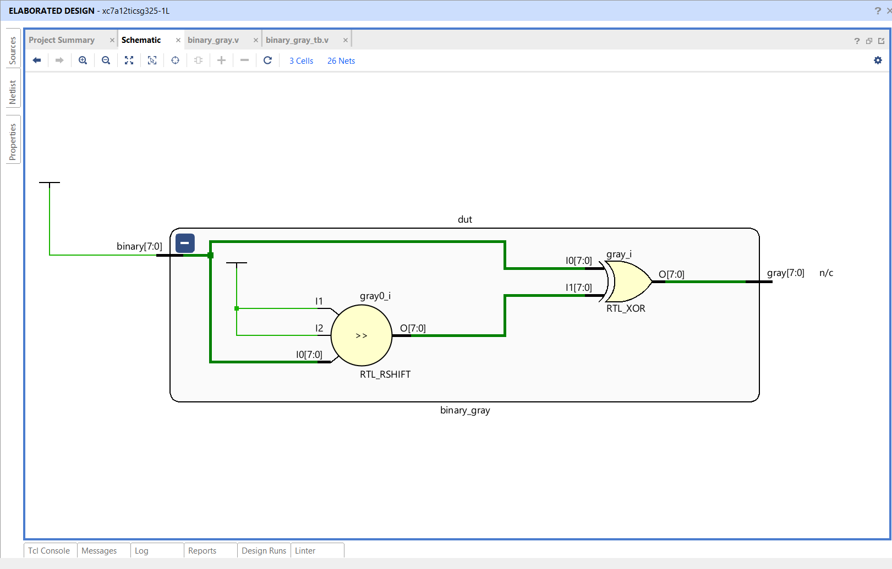

# 🔥 Parameterized Binary to Gray Code Converter using Verilog HDL

## 📌 Project Overview

This project implements a **Parameterized Binary to Gray Code Converter** using **Verilog HDL**. The converter transforms an N-bit binary number into its corresponding Gray code using combinational logic.

Unlike a fixed-width converter, this design is **parameterized**, allowing the bit width to be easily modified by changing a single parameter. The project was designed, simulated, and verified using **Xilinx Vivado 2025.2**.

---

## 🚀 Features

- ✅ Parameterized Verilog design
- ✅ Supports any input width (default: 8-bit)
- ✅ Pure combinational logic
- ✅ Synthesizable RTL
- ✅ Functional verification using a custom testbench
- ✅ RTL schematic generation
- ✅ Behavioral simulation in Vivado

---

## 🛠️ Tools Used

- Verilog HDL
- Xilinx Vivado 2025.2
- XSim Simulator
- RTL Analysis
- Behavioral Simulation

---

## 📂 Project Structure

```
Binary-to-Gray-Converter/
│── binary_gray.v          # Parameterized Binary to Gray Converter
│── binary_gray_tb.v       # Testbench
│── waveform.png           # Simulation Waveform
│── rtl_schematic.png      # RTL Schematic
│── README.md
```

---

## ⚙️ Design Description

The Binary to Gray converter uses the following expression:

```
Gray = Binary ^ (Binary >> 1)
```

where

- `^` → Bitwise XOR
- `>>` → Right Shift Operator

Since Gray code changes only **one bit** between consecutive numbers, it is widely used in digital communication, rotary encoders, and asynchronous circuits to reduce transition errors.

---

## 📐 Module Interface

### Inputs

| Signal | Width | Description |
|--------|------|-------------|
| binary | SIZE | Binary Input |

### Outputs

| Signal | Width | Description |
|--------|------|-------------|
| gray | SIZE | Gray Code Output |

---

## 🧪 Simulation Results

The design was verified using multiple binary input values.

| Binary Input | Gray Output |
|--------------|-------------|
|00000000|00000000|
|00000001|00000001|
|00000010|00000011|
|00000011|00000010|
|00000111|00000100|
|00001000|00001100|
|00001111|00001000|
|00010000|00011000|
|00011111|00010000|
|00111111|00100000|

All outputs matched the expected Gray code values.

---

# 📸 Simulation Waveform



---

# 🏗 RTL Schematic



---

## 📊 Verification Flow

```
Binary Input
      │
      ▼
Right Shift (>>1)
      │
      ▼
Bitwise XOR
      │
      ▼
Gray Code Output
```

---

## 🎯 Applications

- Digital Communication Systems
- Rotary Encoders
- Error Reduction
- FPGA Design
- VLSI Systems
- Embedded Systems

---

## 📚 Learning Outcomes

Through this project, I learned:

- Verilog HDL Programming
- Parameterized Module Design
- Continuous Assignment (`assign`)
- Bitwise Operations
- Shift Operators
- RTL Design
- Functional Verification
- Testbench Development
- Vivado Design Flow

---

## 🔮 Future Enhancements

- Gray to Binary Converter
- Bidirectional Converter
- Self-checking Testbench
- SystemVerilog Assertions
- FPGA Hardware Implementation

---

## 👨‍💻 Author

**TS Sai Likhith**

B.E – Electronics and Communication Engineering (ECE)

### Areas of Interest

- VLSI Design
- Digital IC Design
- RTL Design
- FPGA Design
- Design Verification

---

⭐ If you found this project helpful, please consider giving it a **Star ⭐** on GitHub.
